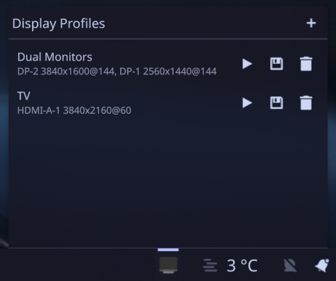

# Display Config Switcher

A Plasma 6 plasmoid that lets you save and switch between display configurations.

> [!NOTE]
> This project was primarily developed with [Claude Code](https://claude.ai/code).  
> I quickly created this for myself as there seems to be no maintained alternative.  
> I can't really guarantee best practices are followed, but it works fine for me.  
> If you're using it and it works, great! If not or something is missing, feel free to create an issue and I'll see what I can do.



## Features

- Save your current display configuration as a named profile
- Switch between saved profiles from the panel
- Uses `kscreen-doctor` under the hood for display management
- Works on both X11 and Wayland

## Installation

Requires Plasma 6 and `kscreen-doctor` (included with KDE Plasma).

```bash
kpackagetool6 -t Plasma/Applet --install package/
```

After installation, add "Display Config Switcher" to your panel via the widget picker.

To upgrade after pulling new changes:

```bash
kpackagetool6 -t Plasma/Applet --upgrade package/
```

Restart the Plasma Shell afterwards.

To remove:

```bash
kpackagetool6 -t Plasma/Applet --remove dev.markusrenken.displayconfigswitcher
```

## Development

### Requirements

- Plasma 6 development environment
- `kpackagetool6` (from `plasma-sdk` or equivalent package)
- `plasmoidviewer` (from `plasma-sdk`, optional, for testing without installing)
- CMake (optional, for system-wide install)

### Testing

```bash
plasmoidviewer -a package/
```

## Releasing

1. Update `Version` in [package/metadata.json](package/metadata.json)
2. Commit the version bump
3. Tag and push:
   ```bash
   git tag v<version>
   git push origin main v<version>
   ```
4. GitHub Actions builds the `.plasmoid` file and creates a [GitHub Release](https://github.com/z0n/plasma-applet-display-config-switcher/releases)
5. Upload the `.plasmoid` from the release to the [KDE Store](https://store.kde.org)
